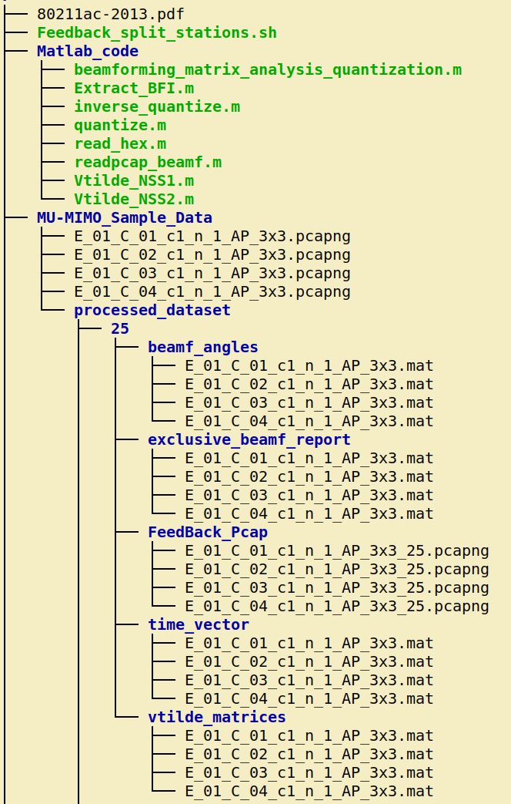

# MU-MIMO_Beamforming_Feedback_Extraction

This repository provides tool for the IEEE 802.11ac MU-MIMO Beamforming Feedback Information (BFI) extraction with any Wi-Fi compliant device in monitor mode. We consider that, you have already setup the MU-MIMO WLAN or access to your target MU-MIMO network. However, the extraction tool will also work with any home/office  network where the AP supports IEEE 802.11ac MU-MIMO beamforming. 


*The AP (beamformer) continuously perform channel calibration procedure leveraging the available STAs (beamformees), the BFI contains very rich, reliable and spatially diverse information. Since the BFI is broadcasted by the beamformees, this spatially diverse information can be collected with a single capture by the AP or any other Wi-Fi compliant device*

#### MU-MIMO BFI from AP to the multiple STAs can be collected in a signle capture without any need for specialized equipments or firmware modifications (unlike CSI) which can be leveraged in various applications including *Radio Fingerprinting, Wi-Fi Sensing, Spectrum Sensing*

For capturing such feedback, even  though we do not need any direct communication / link to the AP or any STAs, we need to know the communication channel and bandwidth. We need wireshark and airmon-ng tool for capturing the transmission in monitor mode which can be installed with (in any ubuntu or ubuntu based distros):

``` 
sudo apt install wireshark &&
sudo apt-get install -y aircrack-ng &&
sudo apt
```

Please Download the sample data from [here](https://drive.google.com/file/d/1KzG5wX-C226ABX0f2zGy3vz_VKvvR-zi/view?usp=sharing)
and keep in the directory: 'MU-MIMO_Beamforming_Feedback_Extraction/'

```
git clone git@github.com:Restuccia-Group/MU-MIMO_Beamforming_Feedback_Extraction.git
cd MU-MIMO_Beamforming_Feedback_Extraction/
gdown https://drive.google.com/uc?id=1KzG5wX-C226ABX0f2zGy3vz_VKvvR-zi
unzip MU-MIMO_Sample_Data.zip 
```

#### Before proceeding further, let me describe the MU-MIMO setup of the sample data that you downloaded and extracted. We setup a simple MU-MIMO testbed with 1 AP and 3 STAs where AP has three antennas and three spatial streams enabled. On the otherhand, each of the STAs are configured with only one antenna and one spatial streams. UDP streams are sent from the AP to each of the STAs parallaly. 

For parsing the BFI, at first we need to separate the BFI of three different STAs which is done by leveraging tshark by executing the following script:

```
./Feedback_split_stations.sh

```

#### Please replace the MAC address of the STA_1, STA_2 and STA_3 as per your NIC information. For our case they are     "CC:40:D0:57:EA:89", "B0:B9:8A:63:55:9C" and "38:94:ED:12:3C:25" for STA_1, STA_2 and STA_3 respectively. For each of the STAs we create directories with last two digits of their MAC address (this is just for ease of naming ) which is handled by Feedback_split_stations.sh script.
<br />
<br />

Now that the BFI of each of the STAs are separated out and put in the directory : 'MU-MIMO_Beamforming_Feedback_Extraction/MU-MIMO_Sample_Data/processed_dataset/xx/FeedBack_Pcap/', we move forward to the extraction process with matlab. <br />

**(i)** At first, we have to investigate the hex values of the pcap capture of any STA. One file from each configuration would be sufficient. This is needed as there are some redundant bytes which are captured in the wireshark with every BFI packets and we want to skip those bytes. We are naming them skip_byte_per_BFI and skip_byte_per_capture. If the considered capture has n BFI packets then it is structured as:

<br />

*(skip_byte_per_capture + skip_byte_per_BFI + BFI_1) + (skip_byte_per_BFI + BFI_2) + (skip_byte_per_BFI + BFI_3) + .........+ (skip_byte_per_BFI + BFI_n)*

<br />

**(ii)**  Open the pcap file with wireshark and note down the starting of the capture. For the file 'E_01_C_01_c1_n_1_AP_3x3_9C.pcapng', it is '00 00 40' which is the actual starting byte of the captures.

<br />

**(iii)** Now read the same file with predefined "read_hex('xxxxx.pcap')" function which you can find in the Matlab_Code directory of the repo. You will find that, for the BFI_1, the string: '00 00 40' starts at 289th sequence. 

<br />

```
pcap_hex = read_hex('../MU-MIMO_Sample_Data/processed_dataset/9C/FeedBack_Pcap/E_01_C_01_c1_n_1_AP_3x3_9C.pcapng')
```

Thus, 288 = skip_byte_per_capture + skip_byte_per_BFI 

<br />

**(iv)** From the wireshark find the ending bytes for BFI_1, which is '20 22 ec' for the considered capture. and also we node down the captured bytes for BFI_1 which is 1095. 
 
 <br />
 
**(v)** Thus we should find the ending bytes: '20 22 ec' at the sequence number 288+1095= 1383 (IN MATLAB). 
 
 Now look for the starting of the BFI_2 (look for bytes '00 00 40') in 'pcap_hex'., It should be sequence 1417.
 
 <br />
 
```
 Thus, skip_byte_per_BFI= 1417 - (1383 +1)  = 33 and 
 skip_byte_per_capture = (288 - skip_byte_per_BFI) = 255
```

<br />

#### It is to mention that, both skip_byte_per_capture and skip_byte_per_BFI varies depending on the antenna and spatial stream configuration and capturing software version and OS. Thus it is better to check the at least one file from each configuration before parsing. 

<br />
For our antenna and spatial stream configuration of each of the STAs and AP, we get 2 phi and 2 psi angle in each subcarrier for each of the STAs. The number of phi and psi angles will be different depending on the defined standard which you can find [here](https://standards.ieee.org/ieee/802.11ac/4473/). 

<br />
<br />

After we change the *skip_byte_per_capture and skip_byte_per_BFI* field according to our config we can extract the BFI by executing 'Extract_BFI.m'. The script will extract the beamforming angles, exclusive beamforming report, time vector and vtilde matrices for each of the captured BFI packets of all the STAs of the considered MU-MIMO system. 


#### For example: For STA_25 (last two dgits of the mac is 25), beamforming angles, exclusive beamforming report, time vector and vtilde matrices are extracted and saved in beamf_angles, exclusive_beamf_report, time_vector, and vtilde_matrices respectively within the directory '25' as shown below:




